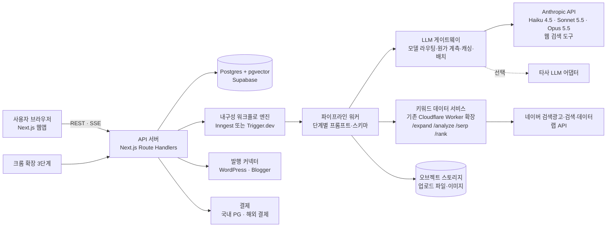

# 블로그 AI 에이전트 개발 계획서 (가칭: 랭크메이트 RankMate)

- 작성일: 2026-10-05
- 벤치마크 대상: 유튜브 「💰최초 공개! 드디어 런칭한 블로그 전문 AI | 대량 생성+고품질 보장하는 블로그 에이전트」 (채널 알파GOGOGO, 2025-10-29 업로드, 13분 35초)
- 분석 방법: 자막 전문(320구간) 정독 + 영상 스토리보드 175프레임(약 4.9초 간격) 화면 확인 + 고해상도 캡처 4장 + 시청자 댓글 약 35개 + 해당 서비스 공식 사이트 요금표 + 정책·법규·API 현황 조사 (분석 방법과 한계는 [부록 A](#부록-a-영상-분석-방법과-한계))
- 기존 자산 연계: 이 저장소의 `custom-gpts/seo-keyword-gpt/` (SEO 블로그 4단계 중 1단계: 키워드 발굴·점수화)

---

## 0. 한 페이지 요약

**벤치마크(알파블로그 AI)가 증명한 수요**: 블로거는 "ChatGPT·Gemini·Claude를 각각 월 $20씩 구독하며 번갈아 쓰는" 대신, 블로그 전용으로 세팅된 하나의 서비스를 원한다. 알파블로그는 ① 3개 모델이 동시에 초안을 쓰고 서로 비교·분석해 최종본을 합성하는 **에이전트 모드**, ② 키워드 30개를 뽑아 글 30편을 병렬 생성하는 **대량 생성 모드**, ③ 네이버·티스토리·워드프레스에 맞춘 **플랫폼별 복사**로 이 수요를 공략했다. 요금은 월 9,900원(30회)부터다.

**우리가 파고들 빈틈** (영상 화면과 댓글에서 직접 확인):

1. 키워드 30개를 **실측 검색량 없이 LLM이 추정**한다. → 우리는 이미 만든 1단계 엔진(네이버 검색광고·블로그 문서 수·데이터랩)으로 **데이터 기반 선정**.
2. 대량 생성 결과 제목이 **거의 똑같다**(썸네일 화면의 30편 중 보이는 8편이 모두 같은 문구로 시작). → 키워드 잠식·스팸 판정 위험. 우리는 **검색 의도별 토픽 클러스터 + 중복 제거 + 분산 발행**.
3. **최신 정보 조사를 하지 않는다**(운영자 답변: 최신 정보는 사용자가 직접 파일로 넣어야 함). → 우리는 **웹 리서치와 문장 단위 출처 검증을 기본 탑재**.
4. 경량 모델 3개가 **같은 일을 3번** 한다. → 우리는 조사·기획·집필·비평·편집·검수로 **역할을 나눈 파이프라인**, 최종 편집만 상위 모델.
5. **자동 발행·이미지 없음, 오류가 나도 횟수 차감, 결제 수단 제한, 저품질 대응 없음** (모두 댓글로 확인한 불만). → 발행·이미지·공정 과금·국내외 결제·발행 전 품질 진단·발행 후 순위 추적까지 묶는다.

**포지셔닝**: "글을 *많이* 써 주는 도구"가 아니라 **"상위 노출되는 글을 *안전하게*, *꾸준히* 쓰게 해 주는 블로그 성장 에이전트"**.

**일정**: PoC 2주 → MVP 8주(10주 차 비공개 베타) → 확장 2단계 12주. 1~2인 + Claude Code 기준.

---

## 1. 벤치마크 분석: 알파블로그 AI

### 1.1 기본 정보

| 항목 | 내용 |
|---|---|
| 서비스 | 알파블로그 AI (alphablogogo.com), 웹 서비스 |
| 영상 지표(수집 시점) | 조회 6,399 · 좋아요 116 · 댓글 56 |
| 사용 모델(영상 내레이션) | GPT-5 nano, Gemini 2.5 Flash-Lite, Claude Haiku 4.5 — **세 모델 모두 각 회사의 경량·저가 모델** |
| 요금(공식 사이트) | 베이직 무료 월 1회 / 스타터 9,900원 30회 / 프로 19,900원 70회 / 엔터프라이즈 49,900원 200회 (에이전트 모드 기준, 회당 약 250~330원) |
| 정책 | 데이터 3개월 보관, 남은 사용량 이월, 결제 후 7일 내 미사용 시 환불, 생성물 저작권 사용자 귀속 |
| 수익원(화면에서 확인) | 구독료 + 좌측 '광고 문의' 플로팅 배너 + 우측 자사 다른 서비스('알파 스튜디오 AI') 홍보 배너 |
| 커뮤니티 | 오픈카톡방으로 이벤트·소식 공지 |

### 1.2 화면 흐름 (영상 타임라인)

| 시간 | 화면 | 핵심 내용 |
|---|---|---|
| 00:00–00:43 | 인트로 | 한 번 입력하면 ChatGPT·Claude·Gemini가 각각 초안 작성 → 분석 → 종합. 대량 생성은 직접·간접·롱테일 키워드 10개씩 30개 → 글 30편 |
| 00:44–01:48 | 개발 동기 | 블로그 하나 운영하려고 범용 LLM을 $20 넘게, 여러 개 구독하는 사용자가 많다 → 통합 서비스 |
| 01:48–01:56 | 랜딩·로그인 | "고품격 고품질 블로그 AI" 히어로 + 로봇 이미지 + 기능 카드 3개, 소셜 로그인(노란 버튼) |
| 01:56–03:14 | **에이전트 Step 1 입력 폼** | 주제(정부 지원사업 2차 공고), **파일 업로드(11쪽 한글 공고문)**, 대상 독자(지원자), 세부 키워드, **글 의도**(정보성·방문/여행기·제품 리뷰 등), **톤·스타일**(프리셋 + 직접 입력, 예: "친절하고 명확하게"), **연령대 칩**(30·40·50·60대) |
| 03:14–04:23 | **Step 2 초안 생성** | 4단계 진행 바. Claude(주황)·Gemini(파랑)·ChatGPT(초록) **3열 카드에 동시 스트리밍**, 카드별 '편집'·'자세히' 버튼, 모달에서 전문 보기·수정 |
| 04:23–06:15 | **Step 3 분석** | 모델별 잘된 점·아쉬운 점·개선점(수치 불일치, 출처 인용 부족 등). 업로드한 공고문과 마감일(11/19)을 대조해 검증하는 장면 |
| 06:15–07:07 | **Step 4 최종 생성** | "알파블로그 AI가 최고의 고품격 블로그 콘텐츠를 생성합니다" — 1~3단계 결과(입력·초안·분석)를 종합한 최종본이 마크다운으로 스트리밍, 마지막에 태그 |
| 07:07–08:35 | **플랫폼별 복사** | 티스토리(마크다운·HTML), 워드프레스·블로그스팟(HTML), 네이버(일반 LLM 결과를 붙이면 줄바꿈이 깨지는 문제를 해결한 서식 유지 복사). 실제 티스토리·네이버 에디터에 붙여넣기 시연 |
| 08:35–09:04 | 대시보드 | 생성 이력 목록, 목록에서도 복사 버튼 |
| 09:04–10:29 | **대량 생성 Step 1~2** | 주제 "블로그 수익화", 타깃 "초보 블로거" → **직접·간접·롱테일 키워드 각 10개(보라·파랑·초록 3열)**, 개별 수정 가능 |
| 10:29–10:57 | **주제(메타) 생성** | 30개 주제마다 제목·부제·메타 설명·발췌문·핵심 키워드·관련 태그·추천 해시태그·글 구조(H1/H2) |
| 10:57–12:16 | **30편 병렬 생성** | 진행률 바(30/30), 편당 2,000~3,000자, 완료된 글부터 열람·복사 |
| 12:16–12:43 | 저장·이력 | MD 파일로 PC 저장, 대시보드 '내 글 보기 > 대량 생성 모드'에서 입력값과 30편 재열람 |
| 12:43–13:35 | 아웃트로 | 오픈카톡 이벤트 안내, 다음 영상 예고(비개발자의 개발기) |

### 1.3 강점 (따라잡아야 할 기준선)

- **한 번 입력하면 끝까지 자동 진행**되는 4단계 마법사 UX, 단계마다 실시간 스트리밍으로 "AI가 일하는 모습"을 보여 줌
- **세 모델 비교 화면**이 주는 신뢰감("세 AI가 교차 검증한다"는 메시지가 마케팅 포인트)
- 업로드 파일(한글·PDF 공고문)을 근거로 쓰는 기능
- **네이버 서식 깨짐 해결** — 사용자의 실제 고통을 정확히 짚은 기능
- 대량 생성 시 제목뿐 아니라 메타 설명·태그·해시태그·글 구조까지 만들어 주는 꼼꼼함
- 낮은 가격(월 9,900원)과 무료 체험

### 1.4 약점과 기회 (근거 포함)

| # | 약점 | 근거 | 우리의 기회 |
|---|---|---|---|
| W1 | 키워드를 LLM이 추정 (검색량·경쟁도 없음) | 대량 생성 Step 2 화면: 키워드 칩만 있고 수치 없음 | 실측 데이터 기반 키워드 엔진(이미 1단계 보유) |
| W2 | 30편 제목이 거의 동일 → 서로 같은 검색어를 놓고 경쟁 | 썸네일의 '30개 글 생성 완료' 화면: 보이는 8편이 모두 "한국 야구 2025 코리아시리즈 한화 vs 엘지 누가 이길까?"로 시작 | 검색 의도별 클러스터링, 중복 제거, 내부 링크, 분산 발행 |
| W3 | 최신 정보 조사 없음 | 운영자 댓글: 최신 정보는 텍스트·파일로 직접 넣어야 함 | 웹 리서치 + 문장 단위 출처·검증 |
| W4 | 경량 모델 3개가 같은 작업 반복 → 품질 상한 낮음 | 내레이션: GPT-5 nano / Gemini 2.5 Flash-Lite / Claude Haiku 4.5 | 역할 분담 파이프라인 + 최종 편집은 상위 모델 |
| W5 | 자동 발행 미지원 | 운영자 댓글: 정식 서비스로 지원하지 않음 | 워드프레스·블로거 API 직접 발행, 네이버·티스토리는 에디터 삽입 보조 |
| W6 | 이미지 없음 | 댓글: 그림 생성 + 자동 업로드 요청 | 썸네일·표·차트·대체 텍스트 |
| W7 | 오류가 나도 횟수 차감 | 댓글: 모바일에서 3단계 오류, 횟수만 차감 | 단계별 저장·자동 재시도, **완료 시에만 차감** |
| W8 | 결제 수단 제한 | 댓글: 휴대폰 결제, 페이팔·해외 카드 요청 | 국내 PG(카드·휴대폰·간편결제) + 해외 결제 |
| W9 | 저품질·중복 대응 없음 | 댓글: 네이버 복붙 괜찮은지, 블로그 분석 도구에서 저품질로 떨어졌다는 사례 | 발행 전 품질 진단 + 발행 후 순위 추적 |
| W10 | 사실 오류(환각) 불안 | 댓글: Gemini가 없는 사실을 단정해 블로그에 못 맡기겠다는 우려 | 검증 안 된 수치·주장 하이라이트, 출처 없는 단정 금지 |

---

## 2. 시장·환경 분석

### 2.1 댓글로 본 수요 신호

| 요구 | 의미 | 반영 기능 |
|---|---|---|
| "기존 ChatGPT·Gemini·Claude와 뭐가 다른가" | 범용 LLM 대비 차별점이 핵심 구매 요인 | 데이터·리서치·검증·발행·추적 등 범용 LLM이 못 하는 것 |
| 네이버·티스토리 자동 등록 | 발행까지가 업무의 끝 | 직접 발행(가능 플랫폼) + 삽입 보조 |
| 네이버 복붙·중복·저품질 걱정 | 검색 노출 손실이 가장 큰 두려움 | 품질 진단, 유사도 검사, 순위 모니터링 |
| 최신 정보 정확성 | 환각에 대한 불신 | 웹 리서치 + 출처 표시 + 검증표 |
| 대량 배포용 | 다계정·다블로그 운영자 존재 | 클러스터 모드, 에이전시 플랜(단, 스팸 방지 장치 필수) |
| 이미지 생성 | 글만으로는 발행 준비가 안 끝남 | 썸네일·도표 |
| 휴대폰 결제·해외 카드 | 결제 장벽 | 결제 수단 다양화 |
| 알고리즘 변화에 맞춘 업데이트 여부 | 지속적 최적화를 기대 | 성과 데이터 기반 규칙 업데이트, 변경 로그 공개 |
| 젠스파크와 비슷하다 | 범용 AI 에이전트와 비교됨 | "블로그 성장" 특화 기능으로 차별화 |

### 2.2 플랫폼 발행 API 현황

| 플랫폼 | 공식 글쓰기 API | 전략 |
|---|---|---|
| 네이버 블로그 | 없음 (과거 API 종료) | 스마트에디터 호환 서식 복사 + (3단계) 브라우저 확장으로 에디터에 원클릭 삽입. **자동 로그인·자동 발행 매크로는 제공하지 않음**(약관·계정 제재 위험) |
| 티스토리 | 없음 (Open API 2024년 종료) | 마크다운/HTML 복사 + 확장 삽입 |
| 워드프레스 | REST API (애플리케이션 비밀번호) | 직접 발행·예약·카테고리·태그·대표 이미지 |
| 블로거(블로그스팟) | Blogger API v3 (OAuth) | 직접 발행·예약 |

### 2.3 검색엔진 정책

- **구글**: '대규모 콘텐츠 남용(scaled content abuse)' 정책 — 사람에게 도움이 되기보다 순위 조작을 위해 대량으로 만든 페이지를 제재하며, AI 사용 여부보다 **목적과 규모**를 본다. 2025년 6월부터 이 사유의 수동 조치가 나왔고, 2026년 5월 정책 문구를 AI 답변(AI 개요 등) 조작까지 넓혔으며, 2026년 8월 스팸 업데이트가 전 언어에 적용됐다.
- **네이버**: AI로 쓴 글이라도 좋은 문서면 문제없다는 입장. 다만 **복사·짜깁기로 대량 생성한 어뷰징 문서는 저품질**로 판단. 2025년 5월부터 'AI 활용' 표기 기능 제공(블로그는 권장 사항).
- **시사점**: "30편을 한 번에 찍어 같은 날 발행"하는 방식은 양 검색엔진 모두에서 가장 위험한 사용 패턴이다. 우리 제품은 **대량 생성 기능을 제공하되, 기본값을 안전한 쪽(의도 분산, 중복 차단, 분산 발행, 사람 검수)으로 설계**한다.

### 2.4 법규

| 법규 | 핵심 | 제품 반영 |
|---|---|---|
| AI 기본법 (2026-01-22 시행) | AI 서비스를 제공하는 **사업자**에게 생성물 표시 등 투명성 의무. 이미지·영상·음성 생성물 표시가 중심. 1년 이상 계도 기간 | AI 생성 이미지에 메타데이터 + 선택형 가시 표시, 서비스 내 "AI 생성 결과물" 고지, 이용약관 반영 |
| 공정위 추천·보증 심사지침 (2024-09 개정) | 협찬·제휴 수수료 등 경제적 이해관계는 **제목 또는 본문 첫 부분**에 명확히 표시 | 입력 폼에 "협찬/제휴 링크 포함" 체크 → 표기 문구 자동 삽입, 품질 진단 항목화 |
| 의료·건강기능식품·금융 광고 규제 | 효능 단정, 과장 표현 제한 | 업종별 금칙어·주의 표현 사전, 경고 표시 |

---

## 3. 제품 콘셉트와 포지셔닝

**한 문장**: 데이터로 키워드를 고르고, 근거를 조사해 쓰고, 발행 전 저품질을 걸러내고, 발행 후 순위로 다시 고치는 **블로그 성장 에이전트**.

### 3.1 기능 비교

| 기능 | 알파블로그 | 우리 MVP | 우리 2·3단계 |
|---|---|---|---|
| 키워드 선정 | LLM 추정 30개 | **실측 검색량·문서 수·트렌드·노출 기회 점수(S~D 등급)** | 내 블로그 노출 키워드(Search Console) 반영 |
| 고품질 1편 | 3모델 병렬 초안 → 비교 → 합성 | 리서치 → 개요 → 초안 → 루브릭 비평 → 최종 편집 → 검수 | 2안 경쟁 초안, 경험 인터뷰, 내 문체 |
| 대량 생성 | 30편 즉시 병렬 | — | **토픽 클러스터** + 중복 차단 + 내부 링크 + 발행 캘린더 + 배치 할인 |
| 최신 정보 | 파일 업로드만 | **웹 리서치 + 출처** + 파일(PDF·HWP·DOCX) | 출처 신뢰도 등급 |
| 사실 검증 | 모델 간 비교 | **문장 단위 근거 매핑, 미검증 수치 하이라이트** | — |
| 플랫폼 출력 | 네이버·티스토리·WP 복사 | 동일 수준(동등성 확보) | WP·블로거 직접 발행, 에디터 삽입 확장 |
| 이미지 | 없음 | 표 자동 생성 | 썸네일·차트·대체 텍스트 |
| 품질 진단 | 없음 | **저품질 방지 점수표**(유사도·상투어·키워드 밀도·광고 표기·업종 금칙어) | 웹 상위 글 대비 유사도 |
| 성과 추적 | 없음 | — | 키워드별 순위 추적, 리라이트 추천 |
| 과금 | 오류 시에도 차감 | **완료 시에만 차감**, 실패 자동 환원 | — |
| 결제 | 제한적 | 카드·휴대폰·간편결제 | 해외 결제, BYOK(내 API 키) 플랜 |

### 3.2 타깃 사용자 (우선순위 순)

1. **수익형 블로거(애드센스·제휴 마케팅)** — 티스토리·워드프레스·블로그스팟 운영, 키워드 데이터와 발행 자동화에 가장 민감
2. **네이버 블로그 운영자(체험단·지역 소상공인·N잡러)** — 서식 유지, 저품질 회피, 경험 기반 후기
3. **마케팅 대행사·1인 에이전시** — 여러 블로그, 팀 계정, 리포트

---

## 4. 차별화 전략 상세

### D1. 데이터 기반 키워드 엔진 (기존 1단계 자산 재사용)

- 현재 `custom-gpts/seo-keyword-gpt/proxy/worker.js`의 `/expand`(연관·자동완성 확장), `/analyze`(검색량·문서 수·트렌드·노출 기회 → 100점 점수와 S~D 등급)를 그대로 백엔드 서비스로 승격한다.
- 추가 엔드포인트: `/serp`(키워드별 블로그 상위 10개 제목·요약·게시일 → 개요 단계의 "상위 글이 다루는 것/빠진 것" 분석용), `/rank`(내 글 URL의 순위 조회, D8).
- 글 작성 화면에서 키워드를 고르면 등급·검색량·경쟁 비율이 함께 보이게 해서 "왜 이 글을 써야 하는지"를 납득시킨다.

### D2. 안전한 대량 생성: 토픽 클러스터 모드

1. 시드 주제 → D1로 키워드 60~150개 수집·점수화
2. 임베딩으로 **검색 의도가 같은 키워드끼리 묶기** → 묶음 하나당 글 1편(같은 검색어를 두고 내 글끼리 경쟁하지 않도록)
3. 필러(넓은 주제) 1편 + 클러스터(롱테일) N편 구조, **글 간 내부 링크 지도 자동 생성**
4. 제목·핵심 키워드 유사도가 기준(예: 코사인 0.85) 이상이면 병합하거나 다른 각도로 재기획
5. **발행 캘린더**: 기본값 주 3~5편 분산(사용자가 바꿀 수 있지만 위험 경고 표시)
6. 생성은 Batch API로 원가 50% 절감(배치는 보통 1시간 안에 끝나지만 최대 24시간 걸릴 수 있음) → 기본은 "예약 생성", 급하면 "빠른 생성(실시간, 크레딧 추가)" 선택
7. 결과는 **검수 대기열**로 들어가고, 사람이 확인 체크한 글만 내보내기·발행

### D3. 리서치·팩트체크 내장

- 리서치 단계에서 웹 검색으로 정부·공공기관·제조사 공식 출처를 우선 수집하고, 업로드 파일(PDF·HWP·DOCX)과 함께 **사실 카드**(주장, 출처 URL, 게시일, 신뢰도)로 정리한다.
- 집필 단계는 사실 카드에 있는 내용만 수치로 쓰도록 강제하고, 최종본의 날짜·금액·마감일·통계는 **출처와 1:1로 매핑**한다. 매핑이 안 된 문장은 노란색으로 표시해 사람이 확인하게 한다.
- 출력 하단에 "참고 자료" 목록을 자동으로 붙인다(사용자가 끌 수 있음).

### D4. 역할 분담형 에이전트 파이프라인 (vs 같은 작업 3회)

벤치마크는 세 모델이 같은 글을 세 번 쓰고 비교한다. 우리는 **단계마다 다른 역할**을 둔다: 조사원 → 기획자 → 작가 → 비평가 → 편집장 → 검수관. 비평가는 공통 루브릭으로 점수를 매겨 JSON으로 돌려주고, 편집장은 그 지적 사항을 반영해 최종본을 쓴다. 사용자에게는 모델 이름 대신 **"품질 리포트 카드"**(정확성·정보 가치·가독성·SEO·경험성·정책 점수)를 보여 준다. 다양성이 필요하면 초안을 2안으로 만들되 서로 다른 구성(목록형/스토리형)으로 지시한다. "여러 AI 교차 검증"이라는 벤치마크의 마케팅 메시지는 "조사·검증·편집 전담 AI 팀"으로 대체한다.

### D5. 경험(E-E-A-T) 주입과 내 문체 학습

- **경험 인터뷰**: 글 의도에 따라 3~5개 질문(제품 리뷰: 구매 시기·가격·사용 기간·아쉬운 점·사진 / 여행: 날짜·동선·비용·팁)을 먼저 묻고, 답과 사진을 본문의 "경험 블록"으로 녹인다. 벤치마크도 영상 설명란에서 "경험과 관점을 추가하라"고 권하지만 기능으로는 없다.
- **내 문체 학습**: 블로그 주소를 넣으면 RSS로 최근 글 20편을 읽어 문체 프로필(어미, 문장 길이, 이모지 습관, 자주 쓰는 표현, 구성 습관)을 만들고, 이후 모든 글에 적용한다.
- **AI 상투어 제거기**: "~에 대해 알아보겠습니다", "결론적으로", 의미 없는 "다양한·중요합니다" 반복 등을 사전과 모델로 찾아 고친다.

### D6. 발행 전 '저품질 방지' 진단

| 항목 | 방법 | 기준(초기값, 실험으로 조정) |
|---|---|---|
| 내 글 간 중복 | 내 기존 글·같은 클러스터 글과 임베딩 유사도 + 5-gram 중복률 | 유사도 0.85 이상 경고 |
| 웹 상위 글과 중복 | `/serp` 상위 글 요약·본문과 n-gram 중복률 | 연속 일치 구간 경고 |
| AI 상투어 비율 | 상투어 사전 + 문장 패턴 | 문단당 1회 초과 경고 |
| 키워드 배치·밀도 | 제목·첫 문단·소제목 포함 여부, 반복 밀도 | 과다 반복 경고 |
| 모바일 가독성 | 문장·문단 길이, 소제목 간격 | 문단 4줄 초과 경고 |
| 정보 가치 | 상위 글에 없는 사실·표·경험 블록 수 | 0개면 경고 |
| 광고 표기 | 협찬·제휴 체크 시 제목·첫머리 문구 유무 | 없으면 차단 |
| 업종 금칙어 | 의료·건기식·금융 표현 사전 | 해당 시 경고 |
| 근거 매핑률 | 수치·주장 문장 중 출처 연결 비율 | 90% 미만 경고 |

점수가 기준에 못 미치면 "자동 수정" 버튼으로 해당 부분만 고친다.

### D7. 이미지·시각 자료 (2단계)

- **썸네일**: 한글 제목은 이미지 생성 모델에 맡기지 않고 템플릿(HTML/Canvas + 한글 웹폰트)으로 합성한다. AI 이미지 모델은 한글 글자가 자주 깨지기 때문이다. 배경은 사용자 사진 또는 이미지 생성 API.
- **표·차트**: 본문 표 데이터를 코드로 차트 이미지로 렌더링(사실 카드 기반이라 수치가 정확).
- **대체 텍스트·파일명**: 이미지 SEO용 자동 생성.
- AI 생성 이미지에는 메타데이터 표시 + 선택형 가시 표시(AI 기본법 대응).

### D8. 발행·성과 루프 (2~3단계)

- **직접 발행**: 워드프레스 REST API, Blogger API — 예약 발행·카테고리·태그·대표 이미지 포함.
- **네이버·티스토리**: ① 스마트에디터 호환 HTML(인라인 스타일)을 클립보드에 `text/html`과 `text/plain`으로 동시에 써서 서식 유지 붙여넣기(MVP), ② 크롬 확장이 열려 있는 글쓰기 화면에 본문·이미지를 원클릭 삽입(3단계). **최종 '발행' 버튼은 사용자가 누른다.**
- **순위 추적**: 네이버 검색 API(블로그)로 키워드별 내 글 위치를 매일 확인(API 순위는 실제 통합검색 노출과 다를 수 있어 '근사치'로 표기), 구글은 Search Console API(이미 1단계에 액션 정의 있음).
- **리라이트 추천**: 순위가 11~30위에 머무는 글은 "보강하면 1페이지 가능"으로 분류하고, 상위 글 대비 빠진 내용을 찾아 개선본을 제안한다. 이 순위 데이터가 쌓이면 품질 규칙을 고치는 근거가 된다(벤치마크 댓글의 "알고리즘 변화에 맞춰 업데이트되나"에 대한 답).

### D9. 신뢰성과 공정한 과금

- 모든 생성 작업은 **단계별 결과를 저장하는 내구성 워크플로**로 실행: 네트워크·모바일 이탈·모델 오류가 나도 실패한 단계부터 이어서 재개.
- 크레딧은 작업 시작 시 '예약'하고 **완료 시 확정**, 실패하면 자동으로 되돌린다(원장 테이블로 투명하게 기록).
- 결제: 국내 PG 통합(카드·휴대폰·카카오페이·네이버페이·토스페이) + 해외 결제(카드·PayPal).

### D10. 요금 구조로 차별화

- **실시간 vs 예약 생성**: 예약 생성은 Batch API 50% 할인을 크레딧 할인으로 돌려줌.
- **BYOK 플랜**: 자기 Anthropic 등 API 키를 등록하면 LLM 원가는 사용자가 직접 내고 우리는 낮은 월 이용료만 받음 — 벤치마크가 공략한 "LLM 여러 개 $20씩 구독하는 사람"에게 가장 저렴한 선택지.
- **크레딧 이월**과 투명한 단계별 사용 내역.

---

## 5. 기능 명세 (MVP 범위 중심)

### 5.1 모드

| 모드 | 단계 | MVP |
|---|---|---|
| **정밀 모드** (1편 고품질) | ① 키워드·주제 ② 리서치·개요 ③ 초안·비평 ④ 최종본·품질 진단 ⑤ 내보내기 | ✅ |
| **클러스터 모드** (대량) | ① 시드 ② 키워드 데이터 ③ 클러스터·주제 메타 ④ 일괄 생성 ⑤ 검수 대기열·캘린더 | 2단계 |
| **리라이트 모드** | 기존 글 URL → 진단 → 개선본 | 2단계 |

### 5.2 정밀 모드 입력 폼

벤치마크와 같은 항목(주제, 파일 업로드, 대상 독자, 세부 키워드, 글 의도, 톤·스타일 프리셋+직접 입력, 연령대)에 다음을 더한다.

- 대상 플랫폼(네이버/티스토리/워드프레스/블로그스팟) — 길이·서식·소제목 규칙이 달라짐
- 품질 등급(라이트/스탠다드/프리미엄) — 원가와 크레딧이 달라짐
- 목표 분량(기본 2,000~3,000자, 조정 가능)
- 협찬·제휴 링크 포함 여부(광고 표기 자동 삽입)
- 업종(일반/의료·건강/금융/정부지원 등 — 금칙어 사전 선택)
- 경험 인터뷰 사용 여부, 내 문체 적용 여부

### 5.3 화면 목록

1. 랜딩·요금제·FAQ
2. 로그인(카카오·네이버·구글)
3. 대시보드: 남은 크레딧, 최근 글, 발행 캘린더(2단계), 순위 변동(3단계)
4. 키워드 탐색: 시드 입력 → 점수표(1단계 GPT의 50선·TOP 10 형식 재사용)
5. 정밀 모드 마법사(단계 진행 바 + 단계별 실시간 스트리밍)
6. 글 편집기: 본문 편집, 근거 하이라이트, 품질 리포트 카드, 자동 수정
7. 내보내기: 네이버 서식 복사 / 티스토리 MD·HTML / 워드프레스 HTML / MD·DOCX 다운로드
8. 내 글 보관함(모드별 필터, 입력값 재열람 — 벤치마크와 동등)
9. 설정: 블로그 연결, 문체 프로필, 결제·영수증, 크레딧 사용 내역

### 5.4 출력 포맷 변환 (LLM을 쓰지 않는 결정적 코드)

- 원본은 항상 **구조화된 문서 JSON**(제목, 메타 설명, 슬러그, 태그, 블록 배열: 문단·소제목·목록·표·인용·이미지 자리·FAQ)으로 저장
- 변환기: JSON → Markdown / 워드프레스·블로거용 HTML(시맨틱 태그) / 티스토리 HTML / **네이버 스마트에디터용 HTML**(인라인 스타일, 줄바꿈·소제목·굵게·인용·표 보존)
- 네이버 붙여넣기 호환성은 PoC에서 브라우저별로 실험해 규칙을 확정

---

## 6. 시스템 아키텍처



### 6.1 기술 스택 (권장)

| 영역 | 선택 | 이유 |
|---|---|---|
| 언어 | TypeScript 단일 언어(모노레포) | 웹·워커·확장 프로그램 코드 공유 |
| 웹 | Next.js(App Router) + Tailwind | SSR 랜딩(SEO) + 대시보드, 스트리밍 UI |
| DB·인증·스토리지 | Supabase(Postgres, Auth, Storage, pgvector) | 1인 개발에 적합, 소셜 로그인, 벡터 검색 내장 |
| 워크플로 | Inngest 또는 Trigger.dev | 단계별 재시도·체크포인트·동시성 제한 → W7(오류 시 차감) 근본 해결 |
| LLM | Anthropic TypeScript SDK(`@anthropic-ai/sdk`) | 구조화 출력, 웹 검색 도구, 프롬프트 캐싱, Batch API |
| 키워드 데이터 | 기존 `worker.js`(Cloudflare Workers) 확장 | 이미 네이버 API 서명·집계 구현 완료 |
| 파일 파싱 | PDF는 모델에 직접 입력, DOCX는 텍스트 추출 라이브러리, HWPX는 XML 파싱, 구형 HWP는 텍스트 추출기 또는 PDF 변환 | 정부지원·공고문 글 수요(벤치마크 시연 주제) |
| 배포 | Vercel(웹) + Cloudflare(키워드 서비스) | 기존 인프라 재사용 |
| 관측 | 단계별 토큰·원가·지연·실패율 로깅 | 원가 관리와 품질 회귀 감지 |

### 6.2 저장소 구조 제안

```
claude_shorts_maker/
├── custom-gpts/seo-keyword-gpt/   기존 1단계 (유지, worker.js는 서비스로 확장)
├── apps/web/                      Next.js 앱 (UI + API)
├── apps/extension/                3단계: 크롬 확장 (에디터 삽입 보조)
├── packages/pipeline/             단계별 프롬프트, 출력 스키마, 오케스트레이션
├── packages/formatters/           문서 JSON → MD / HTML / 네이버 HTML 변환
├── packages/quality/              품질 진단 (유사도, 상투어, 정책 규칙)
├── evals/                         골든셋, 채점 스크립트, 결과 기록
└── docs/blog-agent-dev-plan.md    이 문서
```

### 6.3 데이터 모델 (핵심 테이블)

| 테이블 | 주요 컬럼 |
|---|---|
| users / workspaces | 플랜, 결제 수단, 팀 구성원 |
| blogs | 플랫폼, URL, 연결 토큰(암호화), 문체 프로필 JSON |
| credit_ledger | 예약·확정·환원 이벤트, 작업 ID, 금액 |
| keyword_snapshots | 키워드, 검색량, 문서 수, 트렌드, 점수, 등급, 조회일 |
| projects | 모드, 입력 폼 원본, 상태 |
| jobs / job_steps | 단계명, 상태, 재시도 횟수, 모델, 입력·출력 토큰, 원가 |
| sources | 사실 카드(주장, URL, 게시일, 신뢰도) |
| articles / article_versions | 문서 JSON, 버전, 품질 점수 |
| quality_reports | 항목별 점수·경고·자동 수정 이력 |
| embeddings | 글·키워드 벡터(중복·클러스터용) |
| publications | 플랫폼, 외부 글 ID·URL, 예약 시각 |
| rank_snapshots | 키워드, 글 URL, 순위, 확인일 |

---

## 7. AI 파이프라인 설계 (정밀 모드)

각 단계는 **구조화 출력(JSON 스키마)** 으로 다음 단계에 넘겨 단계 간 품질을 코드로 검사할 수 있게 한다. 시스템 프롬프트·루브릭·문체 프로필처럼 고정된 앞부분은 **프롬프트 캐싱** 대상으로 맨 앞에 둔다.

| 단계 | 역할 | 모델(스탠다드) | 모델(프리미엄) | 출력 |
|---|---|---|---|---|
| 1 | 브리프: 검색 의도·독자·필수 정보 정리 | Haiku 4.5 | Haiku 4.5 | 브리프 JSON |
| 2 | 리서치: 웹 검색 + 업로드 파일 + 상위 글 분석 | Haiku 4.5 + 웹 검색 3회 | Sonnet 5.5 + 웹 검색 5회 | 사실 카드 배열, 상위 글이 놓친 정보 |
| 3 | 개요: H2/H3, 정보 가치 포인트, 표·FAQ 자리 | Haiku 4.5 | Sonnet 5.5 | 개요 JSON |
| 4 | 초안 | Haiku 4.5 (1안) | Haiku 4.5 + Sonnet 5.5 (구성이 다른 2안) | 문서 JSON |
| 5 | 비평: 공통 루브릭 채점 + 수정 지시 | Haiku 4.5 | Sonnet 5.5 | 점수·이슈 목록 JSON |
| 6 | 최종 편집: 지적 반영, 문체 적용, 경험 블록 | **Sonnet 5.5** | **Opus 5.5** | 최종 문서 JSON (스트리밍) |
| 7 | 검수: 근거 매핑, 금칙어, 광고 표기, 유사도 | 규칙 엔진 + Haiku 4.5 | 규칙 엔진 + Haiku 4.5 | 품질 리포트 |
| 8 | 포맷 변환 | 코드(LLM 미사용) | 코드 | MD / HTML / 네이버 HTML |

**설계 원칙**

- 모델은 **설정 파일 한 곳(라우팅 테이블)** 에서만 바꾼다. 모델 가격·성능이 바뀌면 코드 수정 없이 교체.
- 작은 모델로 충분한 단계(브리프·검수)와 품질을 좌우하는 단계(최종 편집)를 분리해 원가를 통제한다.
- 비평 루브릭은 품질 평가(9장)와 같은 기준을 써서 "제품이 스스로 채점하는 기준 = 우리가 출시 여부를 판단하는 기준"이 되게 한다.
- 사실 카드에 없는 수치는 쓰지 않도록 지시하고, 검수 단계에서 수치 문장과 출처를 코드로 대조한다.

---

## 8. 원가 추정과 요금 설계

### 8.1 Claude 모델 단가 (2026-09 기준, 100만 토큰당)

| 모델 | 입력 | 출력 | 용도 |
|---|---|---|---|
| Claude Haiku 4.5 | $1 | $5 | 브리프·리서치·초안·검수, 클러스터 대량 생성 |
| Claude Sonnet 5.5 | $2 | $10 | 스탠다드 최종 편집, 프리미엄 리서치·비평 |
| Claude Opus 5.5 | $4 | $20 | 프리미엄 최종 편집 |

- Batch API: 모든 토큰 50% 할인(비동기, 예약 생성에 사용)
- 프롬프트 캐싱: 캐시 읽기는 입력 단가의 약 0.1배(Opus 5.5는 0.05배), 5분 캐시 쓰기는 1.25배
- 웹 검색 도구: 1,000회당 $10

### 8.2 글 1편 원가 추정

**가정**: 한국어 본문 3,000자 내외, 최종본 출력 약 6,000토큰(사고 토큰 포함), 환율 1달러 = 1,400원. 한국어 토큰 수는 PoC에서 토큰 카운트 API로 실측해 보정한다.

| 단계 | 스탠다드 | 프리미엄 |
|---|---|---|
| 브리프 | $0.009 | $0.009 |
| 리서치(검색비 포함) | $0.058 | $0.130 |
| 개요 | $0.014 | $0.031 |
| 초안 | $0.035 | $0.105 |
| 비평 | $0.020 | $0.056 |
| 최종 편집 | $0.090 | $0.248 |
| 검수 | $0.015 | $0.015 |
| **합계** | **약 $0.24 (≈ 340원)** | **약 $0.59 (≈ 830원)** |

- **라이트**(웹 리서치 없이 업로드 자료 기반, 최종도 Haiku): 약 $0.14(≈ 190원)
- **클러스터 1편**(Haiku, Batch 50%, 클러스터 공용 리서치 1회를 캐시로 공유): 약 $0.025(≈ 35원) → **30편 약 1,100원 + 공용 리서치 약 180원**

> 벤치마크는 경량 모델만 쓰므로 회당 원가가 우리 스탠다드보다 낮을 것으로 추정된다. 우리는 **가격 경쟁이 아니라 "노출 성과와 안전성"으로 경쟁**하고, 가격 민감층은 라이트·클러스터·BYOK로 받는다.

### 8.3 요금제 (가설, 베타에서 검증)

크레딧 환산: 라이트 5 / 스탠다드 10 / 프리미엄 25 / 클러스터 1편 1 / 키워드 리포트 1 (1크레딧 원가 약 34원 기준)

| 플랜 | 월 요금 | 크레딧 | 예시 사용량 | 최대 사용 시 원가율 |
|---|---|---|---|---|
| 무료 | 0원 | 20 | 라이트 2편 + 키워드 리포트 10회 | — (획득 비용) |
| 스타터 | 14,900원 | 180 | 스탠다드 15편 + 클러스터 30편 | 약 41% |
| 프로 | 34,900원 | 500 | 스탠다드 30편 + 프리미엄 5편 + 클러스터 75편 + 순위 추적 30키워드 | 약 49% |
| BYOK | 9,900원 | 무제한(공정 사용) | 모든 기능, LLM 비용은 본인 API 키 | 인프라 비용만 |
| 에이전시 | 99,000원~ | 1,500 | 블로그 10개, 팀원 5명, 리포트 | 약 51% |

- 실제 평균 사용률을 60%로 보면 원가율은 25~30%대로 내려간다(베타 데이터로 확인).
- 정밀 모드도 급하지 않으면 예약 생성(배치)으로 돌릴 수 있고, 이때 크레딧 30%를 할인한다(클러스터 1편 = 1크레딧은 이미 배치 기준).
- 실패한 작업은 크레딧을 차감하지 않는다.

---

## 9. 품질 평가 체계 (Eval)

- **골든셋**: 6개 분야(정보성, 정부지원·공고, 제품 리뷰, 여행·맛집, IT·생활 팁, 금융·건강 주의 업종) × 키워드 10개 = 60개. 키워드는 1단계 GPT로 S·A 등급 위주로 선정.
- **비교 대상**: ① 벤치마크식(경량 3모델 병렬 → 비교 → 합성)을 우리 코드로 재현한 기준선 ② 우리 파이프라인(라이트·스탠다드·프리미엄).
- **지표**: 사실 오류 수(문장 단위 검증), 근거 매핑률, 정보 가치 점수, 상투어 비율, 내 글 간 유사도, 가독성, 생성 성공률, 단계별 실패율, 편당 원가, 생성 시간.
- **방법**: LLM 채점(루브릭) + 블로거 5명 블라인드 선호도 평가. 프롬프트·모델을 바꿀 때마다 골든셋을 다시 돌려 회귀를 막는다.
- **출시 기준(MVP)**: 사실 오류 편당 평균 0.5건 이하, 근거 매핑률 90% 이상, 생성 성공률 99% 이상, 스탠다드 생성 시간 중앙값 3분 이내, 블라인드 평가에서 기준선 대비 선호 60% 이상.

---

## 10. 개발 로드맵

| 단계 | 기간 | 주요 산출물 | 완료 기준 |
|---|---|---|---|
| **Phase 0: PoC** | 1~2주 차 | 파이프라인 프로토타입(CLI), 한국어 토큰 실측, 기준선 재현, 네이버 붙여넣기 서식 실험, 골든셋 60개 | 블라인드 평가에서 기준선보다 낫다는 신호, 편당 원가 확정 |
| **Phase 1: MVP** | 3~10주 차 | 인증·결제·크레딧 원장, 키워드 서비스 승격(`/serp` 추가), 정밀 모드 4단계 마법사, 문서 JSON + 포맷 변환기(네이버·티스토리·WP·MD), 품질 진단 v1, 보관함, 내구성 워크플로 | 9장 출시 기준 충족 |
| 비공개 베타 | 10주 차 | 베타 50명(1단계 GPT 사용자·커뮤니티), 사용 로그·인터뷰 | 첫 글 생성 전환율, 유료 의향 확인 |
| **Phase 2** | 11~16주 차 | 클러스터 모드 + 배치 생성 + 발행 캘린더, 경험 인터뷰, 내 문체 학습, 썸네일·차트, 워드프레스·블로거 직접 발행, 리라이트 모드 | 클러스터 30편 생성 시 중복 경고 0건 |
| **Phase 3** | 17~22주 차 | 크롬 확장(네이버·티스토리 에디터 삽입), 순위 추적(`/rank`, Search Console), 리라이트 추천, 에이전시·팀 기능, BYOK, 해외 결제 | 발행 후 순위 데이터 수집 자동화 |
| **Phase 4** | 23주 차~ | 원 소스 멀티 유즈: 블로그 글 → 쇼츠 대본·카드뉴스·SNS 캡션(이 저장소의 쇼츠 메이커 방향과 연결), 모바일 PWA, 영어권(구글 중심) 확장 검토 | — |

### Phase 0 첫 주에 바로 할 일

1. `packages/pipeline` 뼈대: 단계별 입출력 스키마 정의(브리프·사실 카드·개요·비평·최종 문서)
2. 1단계 GPT로 골든셋 키워드 60개 선정
3. 벤치마크식 기준선(경량 모델 3개 병렬 → 비교 → 합성) 재현 스크립트
4. 네이버 스마트에디터 붙여넣기 실험 페이지(크롬·엣지·웨일, 소제목·표·인용·줄바꿈)
5. 한국어 3,000자 원고의 실제 토큰 수 측정 → 8장 원가표 보정

---

## 11. 리스크와 대응

| 리스크 | 영향 | 대응 |
|---|---|---|
| 대량 생성이 검색엔진 스팸으로 판정 | 사용자 블로그 노출 하락 → 이탈·평판 손상 | 클러스터·중복 차단·분산 발행 기본값, 하루 발행 권장 상한, 사람 검수 대기열, 약관에 금지 사용 명시 |
| 네이버·티스토리 자동화가 약관 위반 | 사용자 계정 제재 | 자동 로그인·자동 발행 매크로 미제공, 사용자 클릭 기반 삽입만 |
| 표절·저작권 | 법적 분쟁 | 웹 원문 n-gram 중복 검사, 출처 인용, 원문 대량 인용 금지 |
| 사실 오류 | 신뢰 상실(댓글의 핵심 불안) | 사실 카드 기반 집필, 미검증 문장 하이라이트, 업종별 주의 문구 |
| 모델 가격·정책 변화 | 원가 급변 | LLM 게이트웨이 라우팅 테이블, 원가 대시보드, BYOK 대안 |
| 무료 플랜 악용 | 원가 폭증 | 휴대폰 본인 확인 또는 결제 수단 등록 후 무료 크레딧, 속도 제한 |
| 업로드 파일 개인정보 | 유출 위험 | 암호화 저장, 보관 기간 명시(예: 90일), 모델 학습 미사용 고지 |
| 법규(AI 기본법·광고 표기) | 과태료·분쟁 | 생성물 고지·표시 기능, 광고 표기 자동 삽입, 약관 정비 |
| 경쟁사 기능 추격 | 차별성 약화 | 순위 데이터 기반 피드백 루프와 키워드 데이터가 쌓일수록 강해지는 구조를 해자로 |

---

## 12. 운영·마케팅 (Go-to-Market)

- **유입**: 무료 키워드 리포트(1단계 GPT 결과물)를 리드 마그넷으로, 유튜브·블로그에 "실제 상위 노출 사례" 콘텐츠(벤치마크처럼 창업자 채널 활용), 블로그 강사·커뮤니티 제휴(추천 수수료).
- **신뢰 장치**: 공개 변경 로그(알고리즘 대응 업데이트 내역), 실패 시 미차감 정책, 생성물 품질 리포트 공유 링크.
- **커뮤니티**: 오픈채팅 대신 제품 내 공지 + 오픈채팅 병행, 월 1회 "노출 성과 리뷰" 라이브.
- **핵심 지표**: 가입 → 첫 글 생성 전환율, 첫 주 발행 수, 유료 전환율, 월 이탈률, 편당 원가, 30일 내 상위 10위 진입 글 비율.

---

## 부록 A. 영상 분석 방법과 한계

- **수집한 자료**: 한국어 자막 전문(자동 생성, 320구간), 영상 메타데이터·설명란, 스토리보드 이미지 7장(총 175프레임, 프레임당 160×90, 약 4.9초 간격), 고해상도 캡처 4장(1280×720 대표 썸네일 1장 — 대량 생성 완료 화면과 에이전트 Step 2 화면 포함, 480×360 중간 캡처 3장 — Step 4 최종 생성 화면 포함), 시청자 댓글·답글 약 35개, 공식 사이트 요금표.
- **화면 확인 범위**: 스토리보드로 전 구간의 화면 전환·레이아웃·색 구분(3모델 카드, 키워드 3열, 4단계 진행 바, 대시보드, 티스토리·네이버 에디터 붙여넣기 시연)을 확인했고, 세부 글자는 고해상도 캡처와 자막으로 확인했다.
- **한계**: 이 작업 환경에서는 유튜브 봇 차단(403)으로 1080p 원본 영상 파일을 받을 수 없었다. 그래서 스토리보드 해상도로는 읽히지 않는 작은 글자(입력 폼의 세부 선택지 등)는 자막 설명으로 보완했다. 자막은 자동 생성이라 일부 단어가 잘못 인식돼 있어(예: "클로드나이가" = "클로드, 제미나이가") 문맥으로 바로잡았다.

## 부록 B. 시청자 댓글 요지 (의역)

- 블로그 AI 글쓰기 환경이 바뀌는데 프로그램이 계속 업데이트되는지 → 운영자: 최근 최신 모델로 교체
- 기존 Gemini·GPT·Claude와 차이 → 운영자: 블로그 전용 세팅 + 교차 검증
- 네이버·티스토리 자동 등록 가능한지 → 운영자: 정식 지원 안 함
- 네이버에 복사해 붙여도 중복에 안 걸리는지, 복붙하면 안 된다고 들었는데 괜찮은지
- 대량 배포용으로 검토 중, 무료 배포 프로그램과의 차이
- 최신 키워드도 정확한 정보로 쓰는지, 검수 없이 써도 되는지 → 운영자: 최신 정보는 파일·텍스트로 직접 넣어야 하며 사람이 검수해야 함, 무료 플랜 월 2회(현재 사이트는 월 1회로 표기)
- 기존 프롬프트로 쓴 글이 블로그 분석 도구에서 모두 저품질로 떨어지고 조회수가 급감했다는 사례
- 휴대폰 결제 도입 예정 여부, 페이팔·해외 카드 지원 요청
- 모바일에서 3단계 장단점 분석 중 오류가 나는데 횟수는 차감된다는 불만
- 그림 생성과 자동 업로드까지 되면 좋겠다는 요청
- Gemini가 존재하지 않는 사실을 단정적으로 답한 경험 → 블로그 작성을 맡기기 불안
- 젠스파크와 비슷하다는 반응, BGM이 크다는 의견

## 부록 C. 참고 자료

- 벤치마크 영상: https://www.youtube.com/watch?v=9yFxI6QXL6A
- 알파블로그 공식 사이트(요금·기능): https://www.alphablogogo.com/
- Google 대규모 콘텐츠 남용·AI 검색 조작 정책 업데이트(2026-05): https://seosherpa.com/google-just-closed-the-ai-search-loophole-that-gurus-have-been-selling-for-two-years/
- Google AI 콘텐츠 제재 분석(2025-06 수동 조치 등): https://icoda.io/ai/does-google-penalize-ai-content
- 2026년 8월 Google 스팸 업데이트 사례: https://gsqi.com/marketing-blog/august-2026-google-spam-update-case-studies/
- 네이버 AI 생성물 표기 정책(블로그는 자율): https://news.mtn.co.kr/news-detail/2026072417015682342
- AI 기본법 시행과 생성물 표시 의무: https://www.newsis.com/view/NISX20260121_0003485509
- AI 기본법 기업 대응 정리: https://www.skax.co.kr/insight/trend/3666
- 공정위 추천·보증 심사지침(블로그 광고 표기): https://news.mtn.co.kr/news-detail/2024112813355447139
- 티스토리·네이버 블로그 API 종료 관련 논의: https://www.inflearn.com/community/questions/1513877
- Claude 모델 단가·Batch·캐싱·웹 검색 가격: Anthropic 공식 가격 정책(2026-09 기준)
